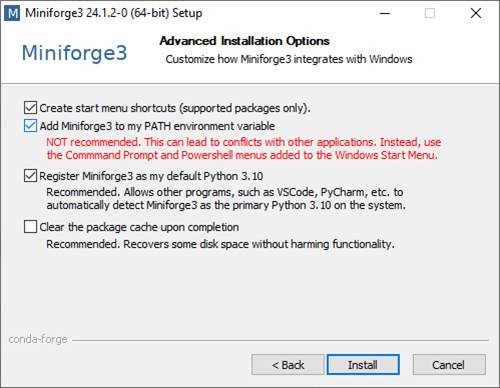

# Setting up Python and Conda environments
Source: [Based on Dr. Robert Haase (ScaDS.AI)](https://github.com/ScaDS/BIDS-lecture-2025/blob/main/01a_setting_up_local_environment/readme.md)

When working with Python, we will make use of many plugins and software libraries which need to be organized.
One way of doing this, is by managing *Conda* environments.
A conda environment can be seen as a virtual desktop, or virtual computer, accessible via the terminal. 
If you install some software into one Conda environment, it may not be accessible from another environment. 
If a Conda environment breaks, e.g. incompatible software was installed, you can just make a new one and start over.

See also
* [Managing Scientific Python environments using Conda, Mamba and friends](https://focalplane.biologists.com/2022/12/08/managing-scientific-python-environments-using-conda-mamba-and-friends/)
* [Scientific Data Analysis with Python](https://youtu.be/MOEPe9TGBK0)
* [Getting started with Mambaforge and Python](https://biapol.github.io/blog/mara_lampert/getting_started_with_mambaforge_and_python/readme.html)

## Step 1: Install Miniforge
Download and install mamba/conda. We recommend the distribution [Miniforge](https://github.com/conda-forge/miniforge#miniforge3).

For ease-of-use, it is recommended to install it for your use only and to add Conda to the PATH variable during installation.




## Step 2: Install environment.yml

- Create the conda environment from the environment.yml file:
```bash
conda env create -f envs/torchvision_env.yml
```

- Activate the environment:
```bash
conda activate torchvision_env
```
- If you want to update the environment.yml file:
```bash
conda env export --from-history --no-builds | grep -v '^prefix:' > torchvision_env.yml
```

- If you want to update your local environment:
```bash
conda env update -f torchvision_env.yml --prune
```

- If you want to create a new environment.yml:
```bash
conda env export --no-builds > torchvision_env.yml
```